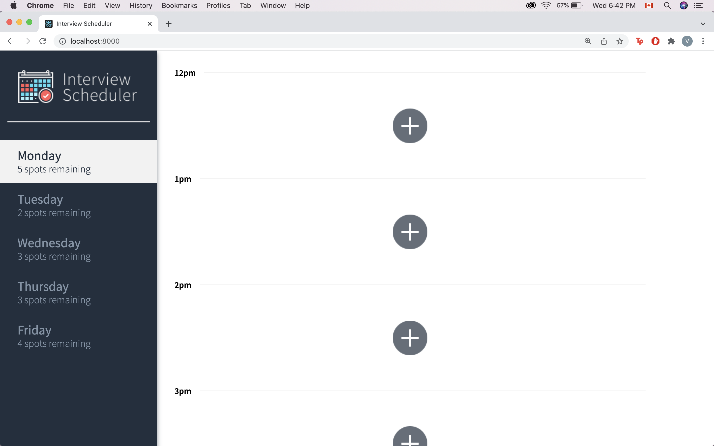
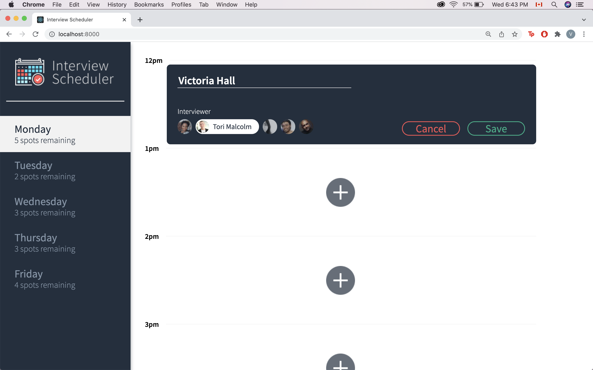
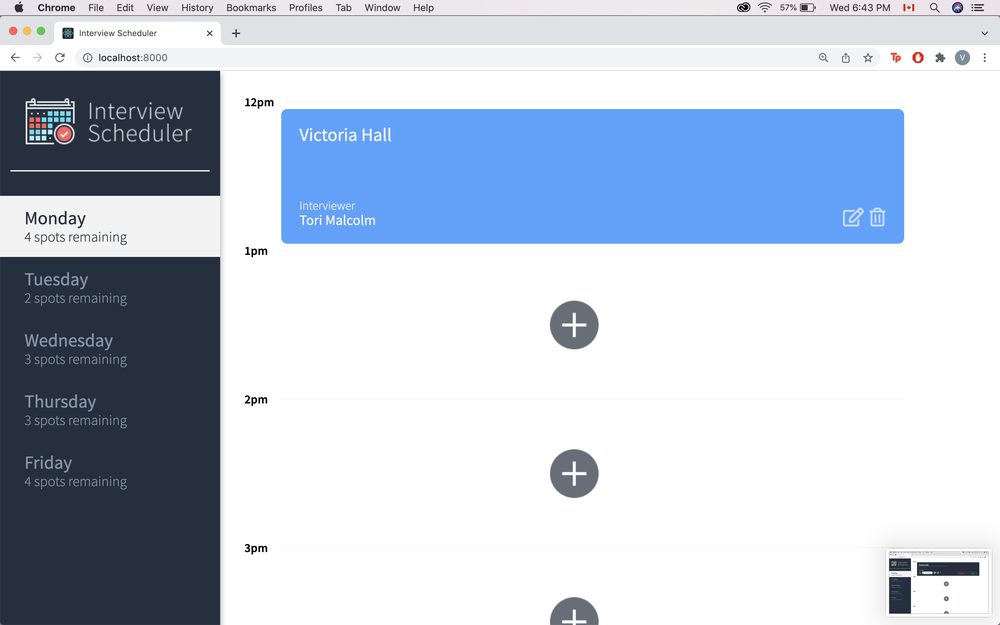
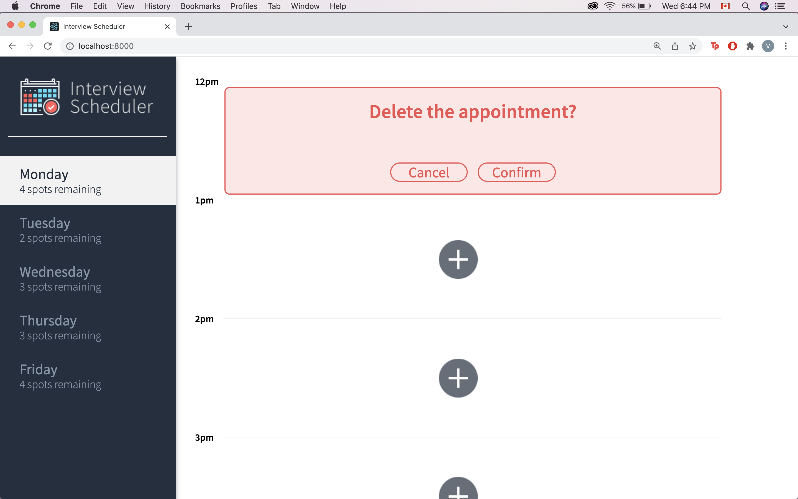
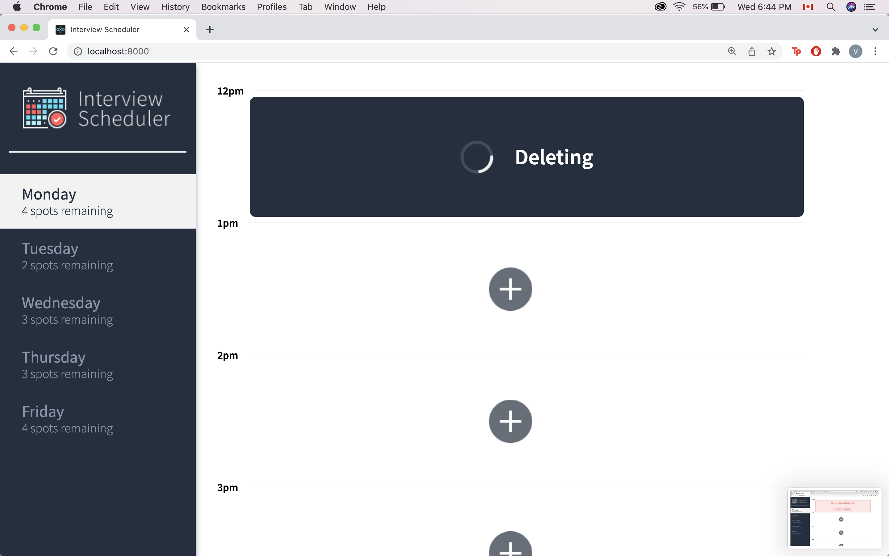

# Interview Scheduler

A single page web application developed using React as a part of the Lighthouse Labs curriculum. Interview Scheduler is a simple appointment scheduling tool. Users can click on an empty timeslot (denoted by the plus sign) and are prompted to enter their name and select an interviewer of their choice to book an appointment. Users can edit, delete, and cancel appointments.

## Get Started

Install all dependencies (using the npm install command) in the root directory.
Get and install the [server](https://github.com/lighthouse-labs/scheduler-api).
Run both the server and the client using npm start in seperate terminal windows.

## Running Webpack Development Server

```sh
npm start
```

## Running Jest Test Framework

```sh
npm test
```

## Running Storybook Visual Testbed

```sh
npm run storybook
```

## Dependencies

```sh
axios: 0.25.0
classnames: 2.2.6
normalize.css: 8.0.1
react: 16.9.0
react-dom: 16.9.0
react-test-renderer: 16.9.0
```

## Final Product









